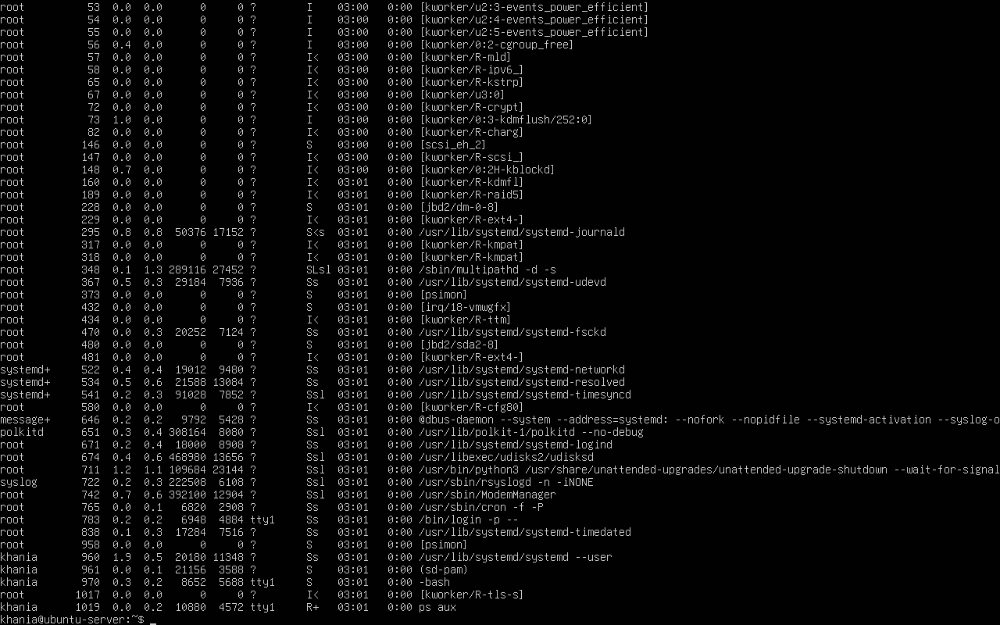
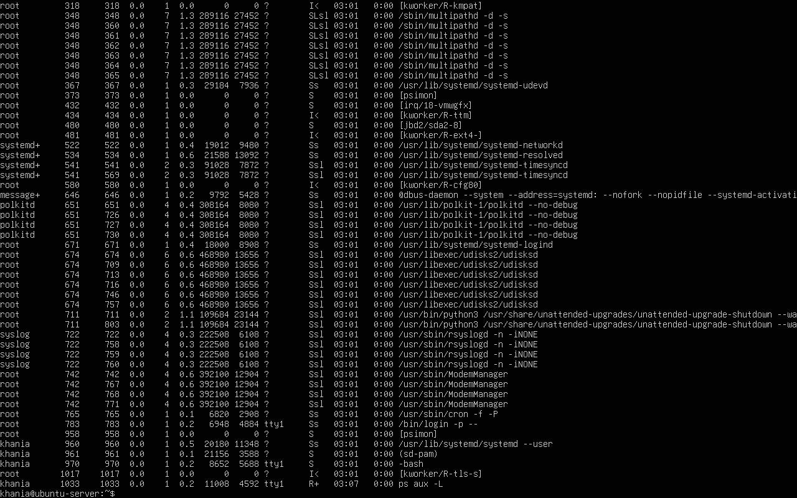

# Laporan Pertemuan 6 (Sistem Operasi)

<h4>Nama : Khaniaa Puji Auliya<h4>
<h4>NIM : 254107020236<h4>
<h4>Kelas : TI-1G<h4>

## Praktikum 6.1 — Melihat Proses dan Theard
1. Tampilkan semua proses yang berjalan

 

2. Tampilkan proses beserta thread-nya, dapat dilihat pada kolom LWP (LightWeight Process ID):

 

3. Lihat PID shell aktif dan detail prosesnya:

 

4. Lihat hierarki proses secara visual:

 

### Latihan 6.1
Jalankan ps aux dan amati outputnya
1. Berapa total proses yang berjalan? Proses apa yang memiliki PID terkecil?
2. Jalankan pstree -p dan temukan proses bash Anda. Proses apa yang menjadi induk (PPID) dari bash tersebut?
3. Bandingkan output ps aux dan ps aux -L. Apa perbedaan yang Anda lihat?

Jawaban:

1. Total proses yang berjalan ada 101, PID terkecil yang terlihat = PID 53, namun PID terkecil yaitu PID 1 (systemd/init) yang tidak terlihat karena output sudah discroll ke bawah.
2. proses bash dengan PID 970 merupakan milik user khania yang login melalui terminal tty1. Proses bash tersebut lahir dari proses login dengan PID 783, sehingga login(783) adalah induk langsung (PPID) dari bash(970). 
3. **ps aux** menampilkan informasi per proses, sedangkan **ps aux -L** menampilkan per thread dengan tambahan kolom LWP (Light Weight Process). Singkatnya, **ps aux** cocok untuk melihat gambaran umum proses, sementara **ps aux -L** lebih detail untuk menganalisis proses multi-thread.

## Praktikum 6.2 — Mengamati Siklus Hidup Proses
1. Buat proses di background dan amati kondisinya:

 

2. Amati perubahan exit code dari perintah yang berhasil dan gagal:

 

### Latihan 6.2 
1. Jalankan sleep 120 & dan amati kolom STAT pada ps aux. Kondisi apa yang ditampilkan? Mengapa proses sleep berada di kondisi tersebut?
2. Jalankan beberapa perintah yang berhasil dan yang gagal, lalu catat exit code masing-masing. Pola apa yang Anda temukan?

Jawaban: 

1. Proses sleep 120 menampilkan status S yang berarti Interruptible Sleep. Proses berada di kondisi ini karena memang hanya menunggu timer 120 detik tanpa melakukan komputasi apapun, sehingga tidak membutuhkan CPU sama sekali.
2. ls /tmp (sukses) exit code: 0

   ls /direktori-tidak-ada (gagal) exit code: 2
   
   Pola: Exit code 0 selalu berarti sukses, sedangkan nilai selain 0 berarti gagal. Semakin spesifik jenis kegagalannya, semakin berbeda nilai exit code-nya.

## Praktikum 6.3 — Mengatur Prioritas Proses
1. Jalankan proses dengan prioritas rendah:

 

2. Verifikasi nilai nice pada kolom NI:

 

3. Ubah nilai nice proses yang sudah berjalan:

 

4. Bersihkan proses percobaan:

 

### Latihan 6.3
1. Jalankan nice -n 5 sleep 200 & dan verifikasi nilai NI-nya dengan ps.
2. Ubah nilai nice menjadi 10 menggunakan renice, lalu verifikasi kembali.
3. Coba ubah nilai nice menjadi -5 tanpa sudo. Apa yang terjadi? Mengapa Linux membatasi hal ini untuk user biasa?

Jawaban: 

1. Perintah nice -n 5 sleep 200 & menjalankan proses dengan nilai nice 5. Verifikasi dengan ps menunjukkan NI = 5.
2. Perintah renice 10 -p 1086 berhasil mengubah nilai nice menjadi 10. Hasil ps menunjukkan NI = 10
3. Saat mencoba renice -5 -p 1086 tanpa sudo, muncul error “Permission denied”. Hal ini karena user biasa tidak diizinkan menaikkan prioritas (nilai nice negatif) demi menjaga keamanan dan stabilitas sistem.

## Praktikum 6.4 — Mengirim Sinyal ke Proses
1. Buat proses percobaan:

 

2. Hentikan satu proses dengan SIGTERM dan verifikasi:

 

3. Jeda dan lanjutkan proses dengan SIGSTOP/SIGCONT:

 

4. Hentikan semua proses sleep sekaligus:

 

### Latihan 6.4 
1. Jalankan sleep 400 &, kirim SIGSTOP, dan amati perubahan kolom STAT. Kondisi apa yang muncul?
2. Kirim SIGCONT dan verifikasi proses kembali berjalan.
3. Hentikan proses dengan SIGTERM lalu verifikasi sudah tidak ada. Kapan Anda memilih SIGKILL daripada SIGTERM?

Jawaban: 

1. Kondisi tersebut menunjukkan kolom STAT berubah menjadi T, yang berarti proses dalam kondisi stopped (dihentikan sementara) dan tidak menggunakan CPU.
2. Kolom STAT berubah dari T menjadi S, yang menunjukkan proses kembali berjalan dalam kondisi sleeping (normal untuk perintah sleep).
3. Proses tidak lagi muncul pada ps, yang berarti proses sudah berhasil dihentikan.
   
   SIGKILL digunakan ketika proses tidak merespon SIGTERM atau dalam kondisi hang. Karena SIGKILL menghentikan proses secara paksa dan tidak bisa ditolak, meskipun tanpa proses cleanup.

## Praktikum 6.5 — Manajemen Job Foreground dan Background
1. Jalankan tiga job di background:

 

2. Bawa job pertama ke foreground, jeda, lalu kembalikan ke background:

 

3. Hentikan semua job

 

### Latihan 6.5
1. Jalankan top di foreground. Apa yang terjadi di terminal?
2. Tekan Ctrl+Z dan cek statusnya dengan jobs. Kondisi apa yang ditampilkan?
3. Pindahkan ke background dengan bg. Apakah top dapat berjalan dengan baik di background? Mengapa?
4. Kembalikan ke foreground dengan fg, lalu keluar dengan q.

Jawaban:

1. Perintah top menampilkan proses secara langsung di terminal. Terminal akan penuh dengan tampilan monitoring dan tidak bisa digunakan untuk perintah lain selama top berjalan.
2. Menekan Ctrl+Z akan menghentikan sementara proses. Saat dicek dengan jobs, status yang ditampilkan adalah Stopped.
3. Setelah dijalankan bg, top masuk ke background tetapi tidak berjalan dengan baik karena top membutuhkan interaksi langsung dengan terminal (bersifat interaktif). Biasanya tampilannya tidak muncul atau berhenti efektif.
4. Perintah fg mengembalikan top ke foreground sehingga tampil normal kembali. Untuk keluar dari top, tekan tombol q.

## Praktikum 6.6 — Pemantauan Proses
1. Temukan proses dengan penggunaan CPU dan memori tertinggi:

 

2. Jalankan top dan eksplorasi shortcut-nya:

 

3. Instal dan jalankan htop:

 

### Latihan 6.6
1. Gunakan ps aux –sort=%mem untuk menemukan proses yang menggunakan memori paling banyak di VM Anda. Proses apa itu?
2. Di dalam top, tekan 1 . Apa yang berubah pada tampilan? Mengapa informasi ini berguna?
3. Di dalam htop, navigasikan ke proses sshd menggunakan tombol panah. Tekan F9 dan amati opsi sinyal yang tersedia.

Jawaban: 

1. proses yang diurutkan berdasarkan penggunaan memori terbesar. Proses yang muncul di urutan paling atas (setelah header) adalah yang paling banyak menggunakan memori, misalnya bisa berupa browser, java, atau aplikasi lain yang sedang berjalan di VM
2. Tampilan akan berubah dari satu bar CPU menjadi beberapa bar sesuai jumlah core CPU. Ini berguna untuk melihat penggunaan CPU per core, sehingga kita bisa mengetahui apakah beban tersebar atau hanya pada core tertentu.
3. Setelah memilih proses sshd dengan tombol panah dan menekan F9, akan muncul daftar opsi sinyal seperti SIGTERM, SIGKILL, SIGSTOP, SIGCONT, dan lainnya. Ini memungkinkan pengguna memilih jenis sinyal yang akan dikirim ke proses tersebut.

## Latihan
### Latihan 6A
Eksplorasi Proses Sistem

Jalankan ps aux –forest dan temukan proses dengan PID
1. Apa nama dan fungsi proses tersebut dalam sistem Linux modern?
2. Hitung berapa proses yang dimiliki oleh user root dan berapa yang dimiliki oleh user Anda. Mengapa root memiliki lebih banyak proses?
3. Temukan semua proses yang berada dalam kondisi S. Mengapa sebagian besar proses di sistem berada dalam kondisi ini?

### Jawaban: 

 

1. Proses dengan PID 1 adalah systemd.
Fungsinya sebagai init system, yaitu proses pertama yang dijalankan saat booting dan bertugas mengelola serta memulai semua proses dan layanan lain di Linux.

 

2. Proses yang dimiliki oleh user root yaitu 85, dan yang dimiliki oleh user yaitu 4.

   Root memiliki lebih banyak proses karena root menjalankan layanan sistem seperti network, daemon, dan service penting lainnya, sedangkan user biasa hanya menjalankan proses yang digunakan sendiri.
3. Banyak proses berada pada kondisi S (sleeping) karena sebagian besar proses sedang menunggu event (misalnya input user, I/O, atau jadwal CPU). Ini normal karena tidak semua proses aktif menggunakan CPU sepanjang waktu.

### Latihan 6B
Simulasi Manajemen Job
1. Jalankan tiga perintah sleep dengan durasi 100, 200, dan 300 detik di background. Verifikasi ketiganya dengan jobs.
2. Bawa job kedua ke foreground, jeda dengan Ctrl+Z , lalu kembalikan ke background dengan bg.
3. Hentikan job pertama dengan kill %1. Tampilkan kembali daftar job. Berapa job yang tersisa?

### Jawaban: 

1. 
2. 
3. 
   
   hanya tersisa 1 job yang masih berjalan, yaitu job ke-3

### Latihan 6C
Prioritas dan Sinyal
1. Jalankan dua proses sleep: satu dengan nice +5 dan satu dengan nice +15. Verifikasi nilai NI keduanya dengan ps.
2. Gunakan renice untuk mengubah nice proses pertama menjadi +10. Proses mana yang kini lebih diprioritaskan scheduler?
3. Kirim SIGSTOP ke salah satu proses, verifikasi kondisi T-nya, lalu kirim SIGCONT. Akhiri semua proses percobaan dengan pkill sleep.

### Jawaban: 

1. 
2. 
3. 
   